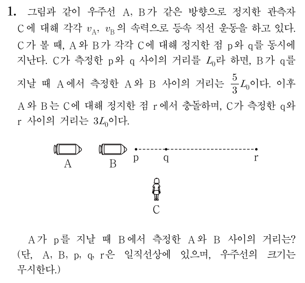

# 두 사건이 다른 위치에서 동시에 일어나는 경우
두 사건이 동시에 일어나는 경우는 사실상 동시성의 상대성과 같은 경우입니다. 따라서 마찬가지로 분석하고자 하는 두 사건의 중앙에 양방 광원을 놓은 뒤 양쪽으로 빛을 동시에 발사하면 됩니다. 이때 문제의 두 사건이 발생하는 동시에, 광원의 빛이 각 사건이 발생하는 위치에 동시에 도달하도록 해야 합니다. 그렇게 해야 두 사건을 빛이 도달하는 사건으로 치환할 수 있기 때문입니다.

직접 다음 예제를 풀어봅시다. 2019학년도 파이널렉쳐 상대성 이론 부분 18번 문제 변형입니다.

## 예제

  

### 풀이

우선 분석할 대상이 될 두 사건을 골라서, 양방 광원의 빛이 도달하는 사건으로 두 사건을 치환해야 합니다. 여기서 대상이 되는 두 사건은 각각 A가 p를 지나는 사건과 B가 q를 지나는 사건이 되겠죠? 왜냐면 그 사건의 정확한 관계가 C의 좌표계에 대해서 정확히 제시가 되어 있거든요.

이 두 사건이 분석의 대상이 된 것은 맞는데, 그냥 이 상태로는 분석이 영 쉽지 않습니다. 그렇기 때문에 성질을 명확히 알고 있는 빛을 도입해 분석이 쉬운 상태로 바꾸어야 하고, 그 수단이 양방 광원인 것입니다. p와 q의 중점에 C에 대해 정지한 양방 광원을 두고, 광원에서 양쪽으로 빛을 동시에 발사하며, 각 빛은 C가 측정할 때 p와 q에 동시에 도달하게끔 설정합시다. 그리고 빛이 p와 q에 도달하는 동시에 A와 B가 p와 q를 지난다고 둡시다. 그러면 A가 p를 지나는 사건은 빛이 p를 지나는 사건으로 치환할 수 있고, B가 q를 지나는 사건은 빛이 q를 지나는 사건으로 치환할 수 있습니다. 이젠 우주선이 점을 지나는 것에 관심을 두지 않고, 빛이 두 점을 지나는 것에만 관심을 두면 됩니다.

이 상황에서 분석이 쉽게 되지 않는 조건은 ‘A가 측정한 A와 B 사이의 거리’입니다. 이제 여기에 집중해봅시다. 문제에선 A가 거리를 측정하는 시점이 B가 q를 지나는 시점이라고 했습니다. 하지만 우리는 이제 우주선 대신 빛에 관심을 두기로 했습니다. 따라서 A가 거리를 측정하는 시점을 빛이 q를 지나는 시점이라고 생각합시다.

  

이제 A의 좌표계에서 p, 광원, q가 어떻게 보이는지 확인해봅시다. 위 그림은 A의 좌표계에서 보이는 모습을 대략 그린 것입니다. 즉 p와 q가 A에 점점 다가가는 모습을 그린 것입니다. p와 q 사이의 별은 빛이 처음에 발사된 위치이며, 화살표는 빛입니다. 첫 번째 그림에서 빛이 발사되기 시작해, 두 번째 그림에서 빛이 q를 지나고, 세 번째 그림에서 빛이 p를 지나는 동시에 A가 p를 지납니다. 여기서 두 번째 그림에서 B는 q를 지나는 중임을 기억합시다. B가 q를 지날 때 A가 측정한 A와 B사이의 거리는, 두 번째 그림에서 B와 q의 위치가 같으므로 거기서 A와 q 사이의 거리와 같습니다. 또한, 두 번째 그림과 세 번째 그림에서 A의 위치는 같으므로 그 거리는 두 번째 그림에서의 q와 세 번째 그림에서의 p 사이의 거리와 같습니다.

그런데 이 거리는 \\(L_A + L_B\\)와 같으므로, 각각을 구해서 더해보겠습니다. 방법은 3번 문단에서와 동일합니다. C가 측정한 A의 속력을 \\(v\\)라고 할 때, 빛이 \\(L_A\\)만큼 가는 데 걸리는 시간은 \\(\frac{L_0}{2\gamma (c-v)}\\)이므로 \\( L_A = \frac{c L_0}{2\gamma (c-v)} \\)입니다. 마찬가지로 \\( L_B = \frac{c L_0}{2\gamma (c+v)} \\)입니다. 따라서
\\[ \frac{5}{3} L_0 = L_A + L_B = \gamma L_0 \\]
입니다. 따라서 \\( \gamma = \frac53 \\)이고 \\(v = 0.8c\\)입니다.

A와 B가 r에서 충돌했다는 것을 고려하면, B의 속력은 A의 \\(\frac34\\)배인 \\(0.6c\\)입니다. A에 대해서 분석했던 것과 동일하게, 빛이 p를 지날 때 B가 측정한 A와 B 사이의 거리를 구해보면 \\( \gamma L_0 = \frac43 L_0 \\)입니다.

정답: \\( \frac43 L_0 \\)

위 문제와 같이 다른 위치에서 동시에 일어난 두 사건에 대해 양방 광원을 사용하려면, 두 사건이 일어나는 위치에 동시에 빛이 도달할 수 있도록 한 다음, 기존의 두 사건을 두 빛이 각 지점에 도달하는 사건으로 치환하여 생각하면 됩니다.
