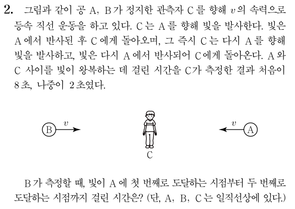
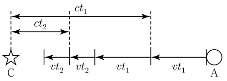

# 두 사건이 다른 위치에서 다른 시간에 일어나는 경우
그렇다면 다른 위치에서 다른 시간에 일어난 두 사건은 어떻게 처리하면 될까요? 기본적인 발상은 동일합니다. 양방 광원에서 나온 두 빛이 각 사건이 일어난 위치에 각 사건이 일어나는 순간 도달하면 됩니다. 다만 그 시간이 동시가 아닐 뿐입니다. 이렇게 만드는 방법은 여러 가지가 있겠지만, 경험적으로 가장 권장하고 싶은 방법은 이렇습니다. 광원을 각 사건이 일어나는 위치의 중점에 놓고, 양쪽 방향으로 시간차를 두고 빛을 발사하는 것입니다. 광원이 두 위치의 중점에 있으니 빛이 광원에서 각 지점까지 가는 데 걸리는 시간이 같을 것이므로, 그 시간차는 두 사건이 발생하는 시간 차이로 설정하면 됩니다. 그 외의 방법은 동일합니다. 광원에서 나가는 빛의 시간차와 무관하게 빛의 속력은 언제나 \\(c\\)니까요.

다만 여기서는 시간 팽창도 고려해야 합니다. 양쪽으로 빛이 나간 시간차가 좌표계마다 다르게 측정될 것이므로 이를 고려해줘야 합니다. 광원의 좌표계에서 빛이 나가는 두 개의 사건은 발생 위치가 같으므로, 광원의 좌표계에서 측정한 두 사건 사이의 시간은 고유시간입니다. 따라서 광원에서 양쪽으로 빛이 나가는 시간차를 다른 좌표계에서 측정하게 되면 이 고유시간에 로렌츠 상수를 곱해준 값이 될 겁니다.

직접 다음 예제를 풀어봅시다. 자작 문항입니다.

## 예제

  

### 풀이
뭔가 C에서 A에 2번 발사한 빛으로 A의 속도를 측정할 수 있다는 느낌이 드네요. 우선 C에서 A까지 처음에 빛이 가는 데 걸리는 시간을 \\(t_1\\), 두 번째로 가는 데 걸리는 시간을 \\(t_2\\)라고 합시다. 그러면 이 문제에선 \\(t_1=\\)4초, \\(t_2=\\)1초가 되겠군요

  

빛을 반사하는 상황을 C에서 본 모습을 간단히 그려보면 위 그림과 같습니다. C를 향해 다가가는 A는 그림 하단의 한쪽 화살표로 표시되어 있고, C에서부터 빛이 A에서 반사되는 위치까지의 거리는 그림 상단의 양쪽 화살표로 표시되어 있습니다. 이를 통해서 \\( v(t_1+t_2) = c(t_1-t_2) \\)이므로 \\(v=0.6c\\)임을 알 수 있습니다. 이제 시간을 구해봅시다.

처음에 할 수 있는 생각으로, 빛이 A에 도달하는 두 사건은 A의 좌표계에서 발생 위치가 같기 때문에, A의 좌표계에서 측정한 시간은 고유시간이라는 것이 있습니다. C의 좌표계에서의 시간은
아니까, 시간 팽창을 역으로 쓰면 A에서 측정한 시간도 구할 수 있겠죠. 이를 통해서 시간 팽창으로 B에서 측정한 시간을 구하면 답이 나올 겁니다.

하지만 문제는, 이 방법을 쓰려면 B의 좌표계에서의 A의 상대속도를 알아야 하는데, 이를 계산할 방도가 딱히 없다는 점입니다. 그렇기 때문에 A의 좌표계에서 해석된 것을 B의 좌표계에서 해석하기는 어렵습니다. 반면 C의 좌표계에서 본 B의 속도는 알기 때문에, C의 좌표계에서 해석된 것을 B의 좌표계에서 해석하는 방향으로 가야 합니다.

시간 측정 대상이 되는 두 사건은 위 그림에서 A가 오른쪽 2개의 점선을 각각 지나는 사건입니다. 두 사건이 일어나는 위치의 거리는 \\(v(t_1+t_2)\\)이고, 시간 차이는 \\(t_1+t_2\\)이며 오른쪽 사건이 우선입니다. 즉, C의 좌표계에서 측정하기에 위치도 다르고 시간도 다른 사건을 B의 좌표계에서 측정해야 하는 상황이므로 양방 광원을 도입하면 편합니다. 편의상 \\( t_1 + t_2 = t^{\prime} \\), \\( v(t_1+t_2)=l \\)이라 합시다.

먼저 두 지점의 중심에 C에 대해 정지한 광원을 놓아봅시다. 그러면 B가 측정하기에 점선과 광원 사이의 간격은 \\(\frac{l}{2 \gamma}\\)입니다. 이제 B에서, 광원에서 오른쪽으로 빛이 발사되는 순간을 \\(t=0\\)이라 하고 타이머로 시간을 재기 시작한다고 해봅시다. 우선 빛이 도달하는 지점은 C를 기준으로 한 것이므로 빛이 오른쪽 점선에 도달하는 시간은 \\( t = \frac{l}{2 \gamma (c+v)} \\)입니다. 이때 빛이 오른쪽 점선에 도달하는 사건은 A가 오른쪽 점선을 지나가는 사건과 같다는 사실을 기억해둡시다.

다음으로 광원에서 왼쪽으로 빛이 발사되는 순간을 찾아봅시다. C가 보기엔, 광원에서 오른쪽으로 빛이 발사되고 나서 \\(t^{\prime}\\)의 시간이 흐르면 광원에서 왼쪽으로 빛이 발사됩니다. 이 두 사건은 C의 좌표계에서 일어난 위치가 광원의 위치로 같으므로 이 \\(t^{\prime}\\)이라는 시간은 고유시간입니다. 따라서 이 두 사건 사이의 시간을 B가 측정한 것은 \\( \gamma t^{\prime} \\)입니다. 즉, B의 좌표계에서 빛이 광원에서 왼쪽으로 발사되는 시간은 \\( t = \gamma t^{\prime} \\)입니다. 이후 빛이 왼쪽 점선에 도달하는 시간은 마찬가지로 \\( t = \gamma t^{\prime} + \frac{l}{2 \gamma (c-v)} \\)가 됩니다.

따라서 B가 측정한, A에 빛이 도달하는 두 사건 사이의 시간 차이, 즉 A가 두 점선 사이를 통과하는 데 걸리는 시간은
\\[ \Delta t = \gamma t^{\prime} + \frac{l}{2\gamma (c-v)} - \frac{l}{2\gamma (c+v)} = \gamma (t^{\prime} \frac{v}{c^2}) \\]
입니다.

이제 수치를 대입해주면 됩니다. \\( \gamma = \frac54 \\), \\( t^{\prime}=5 \\)초, \\( l \frac{v}{c^2} = t^{\prime} \left( \frac{v}{c} \right)^2 = 5 \times 0.36 \\)초이므로, \\( \Delta t = 8.5 \\)초입니다.

정답: 8.5초

이와 같이 양방 광원을 활용하는 것은 분석하고자 하는 두 사건의 위치나 시간 관계가 어떻게 되는지에 큰 구애를 받지 않습니다. 따라서 복잡하게 꼬여 있는 특수 상대성 이론 문제를 풀어내는 도구로 매우 유용합니다. 그 외에도 동시성의 상대성이 헷갈릴 때 간단하게 이 개념을 다시 확인하는 용도로도 적합하기도 하고, 실제 모의고사 형식의 문제를 풀 때에도 때로는 이 발상을 하면 더 멀리 볼 수 있기도 합니다. 이 칼럼에서는 이 도구의 진가를 발휘하기 위해 정량적인 계산 위주로 내용을 풀어나갔지만, 정성적인 비교를 할 때에도 이 도구는 유용하다는 것을 알아두셨으면 합니다.