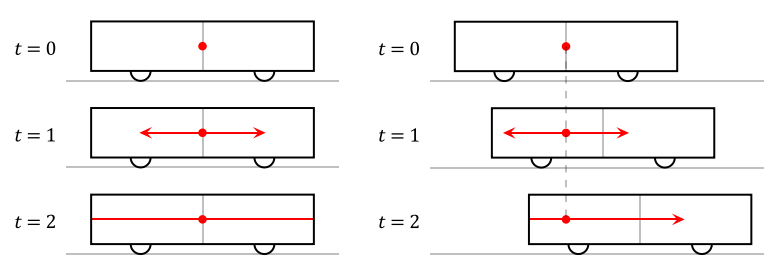

# 정량적인 동시성의 상대성

교과서는 정량적인 계산 시간 팽창과 길이 수축을 유도할 때에만 다룹니다. 하지만 동시성의 상대성은 정량적인 계산을 배우지 않고 사실 위주로 공부하게 되죠. 이 장에서는 동시성의 상대성을 교과서의 유도 방법을 활용해서 정량적으로 유도하게 됩니다.

  

위 그림은 교과서에서 동시성의 상대성을 유도할 때 사용되는 상황입니다. 우선 기차 안의 관찰자가 보기에는 상황이 왼쪽의 그림과 같이 보입니다. 가운데 광원에서 양쪽으로 나간 빛이 각각 열차의 양쪽 끝에 도달한 것은 각각 하나의 사건이라고 할 수 있는데, 열차 안의 관찰자는 이 둘을 동시에 일어나는 것으로 측정합니다. 한편 열차 밖의 관찰자가 보기에는 상황이 오른쪽의 그림과 같이 보입니다. 열차 안의 관찰자에겐 동시에 일어나는 것으로 측정된 이 두 사건을 열차 밖의 관찰자는 다른 시간에 일어나는 것으로 측정합니다. 이것이 동시성의 상대성입니다. 교과서에서는 여기까지만 다루며, 수능에서도 간단한 상황에 대한 정성적인 분석만을 요구합니다.

한편 빛은 강력한 측정도구이기에, 이 현상을 같은 방법으로 정량적으로 설명할 수 있겠죠? 그럼 이제 동시성의 상대성을 정량적으로 분석해봅시다. 단, 길이 수축은 이미 알고 있다고 전제하겠습니다.

열차의 길이를 \\(L=2l\\), 속도를 \\(v\\)라고 둡시다. 그러면 열차 안의 관찰자에겐 두 사건 사이의 위치 차이는 열차의 운동 방향과 나란하게 \\(L\\)로 측정됩니다. 한편 열차 밖의 관찰자에겐 이 상황이 어떻게 보이는지 알아봅시다. 우선 광원에서 양쪽으로 빛이 발사되는 것은 열차 밖에서도 동시에 발사되는 것으로 측정됩니다. 각각의 방향으로 빛이 발사되는 두 사건은 시공간 위에서 같은 한 점으로 해석되므로 두 사건은 정확히 같은 것이기 때문입니다. 왼쪽으로 발사된 빛과 열차의 왼쪽 면이 가까워지는 속도는 \\(c+v\\)입니다.[1](#footnote_1) 따라서 발사된 순간의 시간이 \\(t=0\\)이라면 빛이 열차의 왼쪽 면에 도달하는 시간은 \\( t_1 = \frac{l}{\gamma(c+v)} \\)입니다. 이때 길이 수축을 간과하지 않도록 주의하셔야 합니다. 마찬가지로 오른쪽으로 발사된 빛이 열차의 오른쪽 면에 도달하는 시간은 \\( t_2 = \frac{l}{\gamma(c-v)} \\)입니다. 따라서 열차 밖의 관찰자가 측정하기엔 두 사건은 발생하는 시간이
\\[ \Delta t = t_2 - t_1 = \frac{l}{\gamma} \left( \frac{1}{c-v} - \frac{1}{c+v} \right) \gamma L \frac{v}{c^2} \\]
만큼 차이가 납니다. 또한, \\(t_1 < t_2\\)이므로 열차 밖에선 왼쪽에 있는 사건이 먼저 일어나는 것으로 관찰된다는 것을 알 수 있습니다.

정리하면, 한 관성좌표계 \\(S\\)(열차 안)에서 두 사건이 \\(L\\)의 위치 차이를 두고 동시에 발생한 것으로 관찰되었다면, 그에 대해서 왼쪽으로 상대속도 \\(v\\)로 움직이는 관성좌표계 \\( S^{\prime} \\)(열차 밖)에서는 \\(\gamma L \frac{v}{c^2}\\)의 시간차를 두고 왼쪽에서 발생하는 사건이 먼저 발생하는 것으로 관찰됩니다. \\( S^{\prime} \\)이 \\(S\\)에 대해 움직이는 방향이 반대라면 오른쪽에서 발생하는 사건이 먼저 발생하는 것으로 관찰되겠죠. 이것이 동시성의 상대성에 대한 정량적인 분석입니다.

식은 기억하지 않아도 됩니다. 사건의 시간 차이야 당연히 외울 이유가 없고, 일어나는 순서는 차라리 교과서처럼 유도해야 안 헷갈립니다. 이런 방법으로 정량적으로 분석할 수 있구나 까지만 알아두시면 충분합니다.

---

<a name="footnote_1">1</a> : 어떤 관찰자에 대해 왼쪽으로 움직이는 빛과 \\(v\\)의 속도로 오른쪽으로 움직이는 물체에 대해, 물체에서 빛을 볼 때 \\(c+v\\)의 속도로 가까워지는 것으로 보일 리가 없지만, 관찰자가 보기엔 둘이 \\(c+v\\)의 속도로 가까워지고 있는 것으로 보입니다. 관찰자의 입장에서, 물체만 손으로 가려서 빛이 \\(c\\)의 속도로 왼쪽으로 움직이는 것을 확인하고, 빛만 손으로 가려서 물체가 \\(v\\)의 속도로 오른쪽으로 움직이는 것을 따로 확인한 후, 손을 치웠는데 갑자기 두 물체가 가까워지는 속도가 관찰자 입장에서 \\(c+v\\)가 아니게 되는 게 말이 될까요? 두 물체는 관찰자가 손으로 가리든 말든 관찰자에 대해 각각 \\(c, v\\)의 속력으로 움직일 테죠.